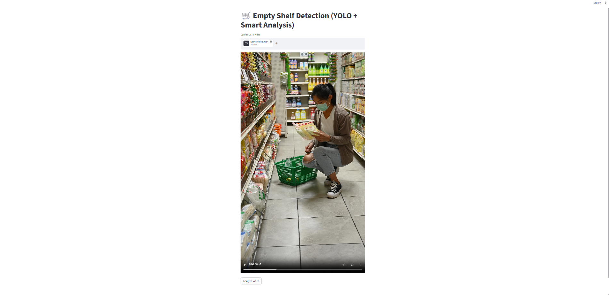
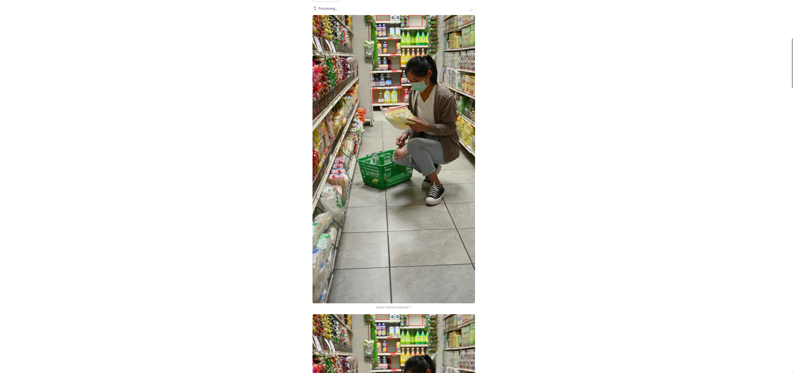

# 🛒 Empty Shelf Detection Using YOLOv8

An AI-powered retail inventory monitoring system that detects **empty and partially empty shelves** from retail store videos using **YOLOv8**, **OpenCV**, and **Streamlit**. This project helps retailers automate shelf monitoring and identify products that require timely restocking.

---

# 📌 Project Overview

Retail stores frequently experience stock-out situations that can negatively impact customer satisfaction and sales. This project leverages **Computer Vision** and **Deep Learning** to automatically detect empty shelf regions from uploaded surveillance videos.

The application provides a user-friendly **Streamlit dashboard** where users can upload a retail shelf video, perform analysis, and visualize the detected empty shelves.

---

# 🚀 Features

- 📹 Upload retail shelf videos
- 🤖 YOLOv8-based shelf detection
- 📦 Detect empty and partially empty shelves
- 🖥️ Interactive Streamlit dashboard
- 🎯 Real-time frame processing
- 📊 Displays total empty shelf count
- ⚡ Fast and easy-to-use interface

---

# 🛠️ Technologies Used

- Python
- YOLOv8 (Ultralytics)
- OpenCV
- Streamlit
- NumPy
- Pandas
- Matplotlib
- Pillow
- Jupyter Notebook

---

# 📂 Project Structure

```
Empty-Shelf-Detection-Model/
│
├── app.py
├── best.pt
├── data.yaml
├── Empty_Shelf_Detection.ipynb
├── requirements.txt
├── README.md
│
├── assets/
│   ├── demo_output.mp4
│   ├── dashboard.png
│   ├── upload.png
│   └── output.png
│
├── docs/
│   ├── Research_Paper.pdf
│   └── Empty_Shelf_Detection_Presentation.pptx
```

---

# ⚙️ Installation

## Clone the Repository

```bash
git clone https://github.com/HarshPatil0804/Empty-Shelf-Detection-Model.git
```

## Navigate to Project Folder

```bash
cd Empty-Shelf-Detection-Model
```

## Install Required Libraries

```bash
pip install -r requirements.txt
```

## Run the Streamlit Application

```bash
streamlit run app.py
```

---

# 📊 Dataset

The complete **StockOut Dataset** is not included in this repository because of GitHub file size limitations.

You can download the dataset from **Harvard Dataverse**:

🔗 https://dataverse.harvard.edu/dataset.xhtml?persistentId=doi:10.7910/DVN/8RET7B

After downloading, extract the dataset and place it inside the project directory before running the application.

---

# 🎥 Demo Video

The complete project demonstration is available inside the **assets** folder.

👉 **[Watch Demo Video](assets/demo_output.mp4)**

---

# 📷 Screenshots

## Dashboard


---

## Upload Video



---

## Detection Result



---

# 💡 Applications

- 🛒 Retail Stores
- 🏪 Supermarkets
- 🏬 Shopping Malls
- 📦 Warehouses
- 📊 Smart Inventory Management
- 🤖 Automated Shelf Monitoring

---

# 🔮 Future Improvements

- 📷 Live CCTV Camera Support (RTSP)
- ☁️ Cloud Deployment
- 📧 Email Notifications
- 📱 SMS Alerts
- 🎥 Multi-Camera Monitoring
- 📈 Inventory Analytics Dashboard

---

# 📄 Documentation

Project documentation is available inside the **docs** folder.

- Research Paper
- Project Presentation

---

# 👨‍💻 Author

**Harshavardhan Rajendra Patil**

🎓 B.Tech in Data Science  
Kolhapur Institute of Technology, Kolhapur

GitHub: https://github.com/HarshPatil0804

---

# ⭐ Support

If you found this project helpful, please consider giving it a **⭐ Star** on GitHub.

It helps others discover the project and motivates further development.
